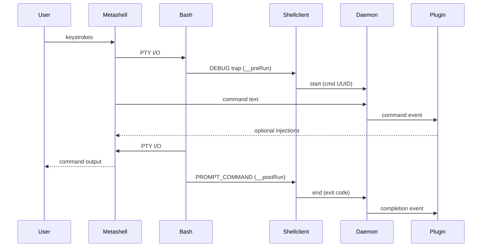

# Metashell

Metashell is a wrapper around the shell (`bash` only for now).
It is able to transparantly capture keystrokes, as well as command exit codes.
Metashell depends on plugins to do anything useful; plugins receive the events captured by metashell and can act on them and even provide their own output and shell injections.

<p align="center">
  
</p>

## Installation
Simply build metashell:
```bash
go build -o metashell ./cmd/metashell
```

Then, add it to your `$PATH`, and then set it as your shell in your terminal emulator; metashell will automatically install the necessary hooks to your shell on first run.

## How it works / Architecture

Metashell is a single binary that runs under 3 main modes, each serving a specific role in the architecture:

### 1. **Metashell Mode** (PTY Wrapper)
The main process that wraps the shell using a **pseudoterminal (PTY)** approach:
- Creates a pseudoterminal pair (master/slave) using the `pty` package
- Starts the shell process with the PTY slave as its controlling terminal
- Sets the user's terminal to raw mode for byte-by-byte keystroke capture
- Intercepts all I/O between the user and shell as the PTY master
- Performs smart filtering: ESC triggers "meta-mode", other keys pass through transparently
- Injects bash hooks on startup via `. <(metashell install)`
- **Buffers keystrokes** and sends command text to daemon when Enter is pressed
- Maintains command execution state (running/idle) based on daemon feedback

### 2. **Daemon Mode** (Event Hub & Command Coordinator)
A long-running process that provides semantic command delineation:
- Receives command strings from metashell instances
- Receives command lifecycle events (start/end) from shellclient hooks
- **Correlates commands with their execution lifecycle** using unique UUIDs to match command text with execution results
- Manages plugin lifecycle using HashiCorp's go-plugin framework
- Forwards complete command events (with metadata and exit codes) to plugins
- Handles bidirectional communication via Unix domain sockets
- Coordinates between multiple metashell sessions

### 3. **Shellclient Mode** (Bash Hook Handler)
A lightweight client triggered by injected bash hooks that provides precise command boundaries:
- **DEBUG trap** (`__preRun`): Called before each command execution
  - Requests UUID from daemon for command correlation
  - Captures exact command text and execution start time
- **PROMPT_COMMAND** (`__postRun`): Called after each command completion
  - Reports command exit code and completion to daemon
  - Enables daemon to close the command lifecycle loop
- **Works with daemon** to transform raw keystroke data into semantically meaningful command events with complete metadata (command text, timing, exit status, TTY context)



## Plugin Development

Metashell's plugin system is built on [HashiCorp's go-plugin](https://github.com/hashicorp/go-plugin) framework, using gRPC for communication. Plugins are standalone executables that communicate with the daemon process.

### Plugin Architecture

Plugins in Metashell implement the `DaemonPlugin` interface and provide two main capabilities:

1. **Command Reporting**: Receive notifications about executed commands with metadata (command text, TTY, timestamp, exit code)
2. **Meta-commands**: Respond to special commands triggered from meta-mode (ESC key) that can provide interactive lists, shell injections, or formatted output

### Getting Started

#### Prerequisites

- Go 1.19+
- Protocol Buffers compiler (`protoc`)
- Access to the Metashell source code for importing plugin packages

#### Basic Plugin Structure

A minimal plugin implements the `DaemonPlugin` interface with four required methods:

```go
type DaemonPlugin interface {
    Init(context.Context, *proto.PluginConfig) error
    Info(context.Context) (*proto.PluginInfo, error)
    ReportCommand(context.Context, *proto.ReportCommandRequest) error
    Metacommand(context.Context, *proto.MetacommandRequest) (*proto.MetacommandResponse, error)
}
```

#### Example Plugin

Here's a complete example of a command logging plugin:

```go
package main

import (
    "context"
    "encoding/json"
    "errors"
    
    "github.com/hashicorp/go-plugin"
    "github.com/raphaelreyna/metashell/pkg/plugin/log"
    "github.com/raphaelreyna/metashell/pkg/plugin/proto/proto"
    "github.com/raphaelreyna/metashell/pkg/plugin/proto/shared"
)

type MyPlugin struct {
    history []string
}

func (p *MyPlugin) Init(ctx context.Context, config *proto.PluginConfig) error {
    // Initialize plugin logging
    log.Init(config)
    log.Info("Plugin initialized")
    return nil
}

func (p *MyPlugin) Info(ctx context.Context) (*proto.PluginInfo, error) {
    return &proto.PluginInfo{
        Name:                  "my-plugin",
        Version:               "v1.0.0",
        AcceptsCommandReports: true,
        Metacommands: []*proto.MetacommandInfo{
            {
                Name:   "history",
                Format: proto.MetacommandResponseFormat_SHELL_INJECTION_LIST,
            },
        },
    }, nil
}

func (p *MyPlugin) ReportCommand(ctx context.Context, req *proto.ReportCommandRequest) error {
    // Handle command reports
    log.Info("Command executed", "command", req.Command, "exit_code", req.ExitCode)
    p.history = append(p.history, req.Command)
    return nil
}

func (p *MyPlugin) Metacommand(ctx context.Context, req *proto.MetacommandRequest) (*proto.MetacommandResponse, error) {
    var resp proto.MetacommandResponse
    
    switch req.MetaCommand {
    case "history":
        items := make([]map[string]string, len(p.history))
        for i, cmd := range p.history {
            items[i] = map[string]string{
                "title":        cmd,
                "description":  "Previously executed command",
                "filter_value": cmd,
                "value":        cmd,
            }
        }
        data, err := json.Marshal(items)
        if err != nil {
            return nil, err
        }
        resp.Data = data
    default:
        resp.Error = "unknown command"
        return &resp, errors.New("unknown command")
    }
    
    return &resp, nil
}

func main() {
    plugin.Serve(&plugin.ServeConfig{
        HandshakeConfig: shared.Handshake,
        Plugins: map[string]plugin.Plugin{
            "daemonPlugin": &shared.DaemonPluginImplementation{
                Impl: &MyPlugin{},
            },
        },
        GRPCServer: plugin.DefaultGRPCServer,
        Logger:     log.GetLogger(),
    })
}
```

### Plugin Interface Reference

#### Init Method
```go
Init(context.Context, *proto.PluginConfig) error
```
Called once when the plugin is loaded. Use this to:
- Initialize plugin logging with `log.Init(config)`
- Set up any required state or connections
- Parse plugin-specific configuration from `config.Data`

#### Info Method
```go
Info(context.Context) (*proto.PluginInfo, error)
```
Returns metadata about your plugin:
- `Name`: Unique plugin identifier
- `Version`: Plugin version string
- `AcceptsCommandReports`: Set to `true` to receive command reports
- `Metacommands`: List of meta-commands your plugin supports

#### ReportCommand Method
```go
ReportCommand(context.Context, *proto.ReportCommandRequest) error
```
Called for each executed command when `AcceptsCommandReports` is true. The request contains:
- `Command`: The executed command text
- `Tty`: The TTY where the command was executed
- `Timestamp`: Unix timestamp when the command was executed
- `ExitCode`: The command's exit code

#### Metacommand Method
```go
Metacommand(context.Context, *proto.MetacommandRequest) (*proto.MetacommandResponse, error)
```
Handles meta-commands triggered from meta-mode. The request contains:
- `MetaCommand`: The meta-command name
- `Args`: Command arguments
- `FormatArgs`: Format-specific arguments
- `Tty`: The TTY where the command was triggered

### Meta-command Response Formats

Your meta-commands can return different response formats:

#### TEXT
Simple text output:
```go
resp.Data = []byte("Hello, world!")
```

#### SHELL_INJECTION
Command to inject into the shell:
```go
resp.Data = []byte("ls -la")
```

#### ITEM_LIST
Interactive list for selection:
```go
items := []map[string]string{
    {
        "title":        "List Files",
        "description":  "Show directory contents",
        "filter_value": "ls",
    },
}
data, _ := json.Marshal(items)
resp.Data = data
```

#### SHELL_INJECTION_LIST
Interactive list where each item injects a command:
```go
items := []map[string]string{
    {
        "title":        "List Files",
        "description":  "Show directory contents", 
        "filter_value": "ls",
        "value":        "ls -la",
    },
}
data, _ := json.Marshal(items)
resp.Data = data
```

### Building and Installing Plugins

1. **Build your plugin**:
```bash
go build -o my-plugin main.go
```

2. **Install the plugin**:
Place the compiled binary in your plugins directory (typically `~/.metashell/plugins/`)

3. **Restart the daemon**:
```bash
metashell daemon stop
metashell daemon start
```

### Plugin Development Tips

1. **Use the provided logging package**: `github.com/raphaelreyna/metashell/pkg/plugin/log`
2. **Handle errors gracefully**: Return appropriate errors from your methods
3. **Test with the example plugin**: Start with the `examples/plugins/command_logging` plugin
4. **Use meta-commands for user interaction**: Provide useful interactive commands via meta-mode
5. **Consider performance**: Command reports are called frequently, keep processing lightweight

### Advanced Features

#### Plugin Configuration
Plugins can receive configuration data through the `Init` method:
```go
func (p *MyPlugin) Init(ctx context.Context, config *proto.PluginConfig) error {
    // config.Data contains plugin-specific configuration
    // Parse your configuration here
    return nil
}
```

#### HTTP Server
Plugins can run additional services like HTTP servers for dashboards or APIs:
```go
func (p *MyPlugin) ServeHTTP(w http.ResponseWriter, r *http.Request) {
    // Handle HTTP requests
}

func main() {
    plugin := &MyPlugin{}
    go http.ListenAndServe(":8080", plugin)
    // ... rest of plugin.Serve() call
}
```

### Example Use Cases

- **Command Analytics**: Track command usage patterns and provide insights
- **Smart Completions**: Offer context-aware command suggestions
- **Integration Tools**: Connect with external services (Slack, JIRA, etc.)
- **Development Helpers**: Git shortcuts, deployment commands, environment management
- **Security Monitoring**: Alert on suspicious commands or patterns

For more examples, see the `examples/plugins/` directory in the source code.
