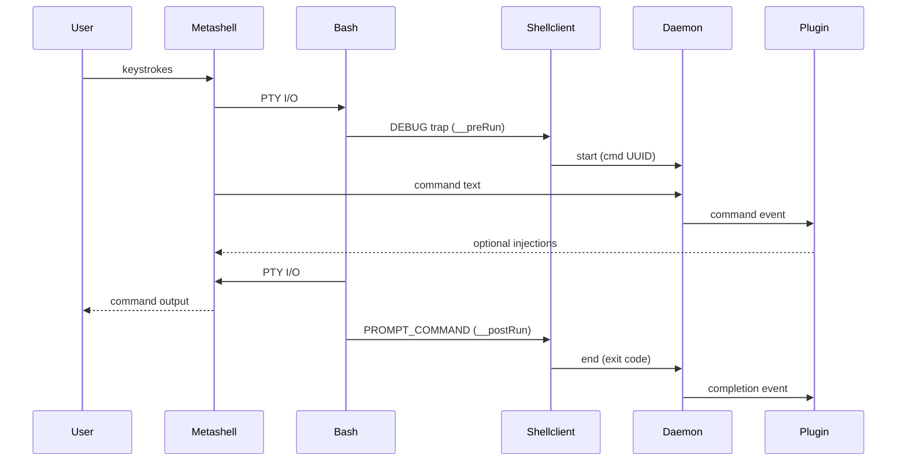

# Metashell

Metashell is a wrapper around the shell (`bash` only for now).
It is able to transparantly capture keystrokes, as well as command exit codes.
Metashell depends on plugins to do anything useful; plugins receive the events captured by metashell and can act on them and even provide their own output and shell injections.

## How it works / Architecture

Metashell is a single binary that runs under 3 main modes, each serving a specific role in the architecture:

### 1. **Metashell Mode** (PTY Wrapper)
The main process that wraps the shell using a **pseudoterminal (PTY)** approach:
- Creates a pseudoterminal pair (master/slave) using the `pty` package
- Starts the shell process with the PTY slave as its controlling terminal
- Sets the user's terminal to raw mode for byte-by-byte keystroke capture
- Intercepts all I/O between the user and shell as the PTY master
- Performs smart filtering: ESC triggers "meta-mode", other keys pass through transparently
- Injects bash hooks on startup via `. <(metashell install)`
- **Buffers keystrokes** and sends command text to daemon when Enter is pressed
- Maintains command execution state (running/idle) based on daemon feedback

### 2. **Daemon Mode** (Event Hub & Command Coordinator)
A long-running process that provides semantic command delineation:
- Receives command strings from metashell instances
- Receives command lifecycle events (start/end) from shellclient hooks
- **Correlates commands with their execution lifecycle** using unique UUIDs to match command text with execution results
- Manages plugin lifecycle using HashiCorp's go-plugin framework
- Forwards complete command events (with metadata and exit codes) to plugins
- Handles bidirectional communication via Unix domain sockets
- Coordinates between multiple metashell sessions

### 3. **Shellclient Mode** (Bash Hook Handler)
A lightweight client triggered by injected bash hooks that provides precise command boundaries:
- **DEBUG trap** (`__preRun`): Called before each command execution
  - Requests UUID from daemon for command correlation
  - Captures exact command text and execution start time
- **PROMPT_COMMAND** (`__postRun`): Called after each command completion
  - Reports command exit code and completion to daemon
  - Enables daemon to close the command lifecycle loop
- **Works with daemon** to transform raw keystroke data into semantically meaningful command events with complete metadata (command text, timing, exit status, TTY context)

